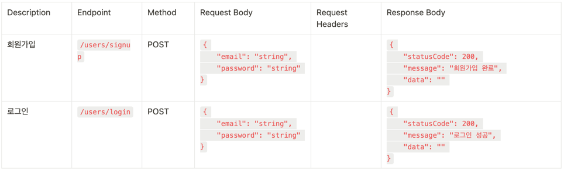

# wanted-pre-onboarding-backend
- **지원자: 정대철** 
- **AWS EC2 배포 ip 주소: 52.79.105.67**
- **구현 영상 링크: https://youtu.be/r4uEyoesGS0**
 
### 간단한 기능 소개
1. 회원가입: 이메일에 @가 포함되어야 하며 비밀번호는 8자리 이상 입력(암호화 저장)
2. 로그인: 로그인시 가입한 이메일, 비밀번호 입력
3. 게시글 작성: 로그인 유저만 작성 가능
4. 게시글 전체 조회: 비회원도 조회 가능
5. 게시글 상세 조회: 비회원도 조회 가능하며 게시글 번호 입력받음
6. 게시글 수정, 삭제: 자신의 게시글만 가능하며 게시글 번호 입력받음

### 클라이언트에서 Http 요청시 

- 회원가입: Post- http://52.79.105.67:8080/users/signup
- 로그인: Post- http://52.79.105.67:8080/users/login
- 게시글 작성: Post- http://52.79.105.67:8080/posts
- 게시글 전체 조회: Get- http://52.79.105.67:8080/posts
- 게시글 상세 조회: Get- http://52.79.105.67:8080/posts/{id}
- 게시글 수정: Put- http://52.79.105.67:8080/posts/{id}
- 게시글 삭제: Delete- http://52.79.105.67:8080/posts/{id}

## ERD

## API 명세서
### Post

### User
